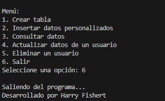

# Consultas Básicas con SQLite

Este proyecto es una aplicación de consola en Python que permite realizar operaciones básicas de gestión de datos utilizando SQLite. Los usuarios pueden interactuar con una base de datos para crear tablas, insertar datos, consultar registros, actualizarlos y eliminarlos.

## Características

- **Gestión de usuarios**: Permite agregar, consultar, actualizar y eliminar registros de usuarios.
- **Persistencia de datos**: Los datos se almacenan en un archivo de base de datos SQLite llamado `main.db`.
- **Interfaz de consola**: Menú interactivo para que el usuario seleccione las acciones que desea realizar.
- **Validaciones robustas**: Manejo de errores y validaciones para entradas de datos.

## Requisitos

- Python 3.7 o superior.
- Biblioteca estándar de Python (no se requieren dependencias externas).

## Cómo usar

1. Clona este repositorio en tu máquina local:
   ```bash
[
](https://github.com/Fishertdevs/Consultas_Basicas.git)
## Preview 

---
- Desarrollado por harry fishert 
